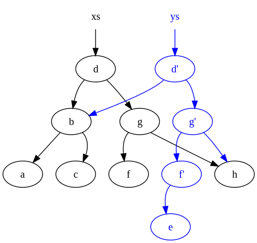

# Database Formats

This document briefly describes the structure of data that the Key Transparency Server
stores in its database. This server is designed to be run on a key-value database,
which may be eventually consistent.

## Log Tree

The log tree is stored in the database in "chunks", which are 8-node-wide (or
4-node-deep) subtrees. Chunks are addressed by the id of the root node in the
chunk. Only the leaf values of each chunk are stored, which in the context of
the full tree is either a leaf or a cached intermediate hash. These values are
stored concatenated. Intermediate values of a chunk are recomputed from the leaf
nodes as needed.

Once a chunk is full, it will never be modified again. However the chunks that
represent the "frontier" of the log will be modified to append new hash values
as the tree grows. Because the hashes in a chunk that represent the frontier of
the log are subject to change, they're explicitly not used when computing things
like the root of the log.

## Prefix Tree

The prefix tree is designed to follow a log structure, where each modification
to the prefix tree produces a new entry in the database addressed by a counter.
Log entries contain the key that was modified by this request and pointers to
the log entries on the key's copath, among other data.

Once an entry is created, it will never be modified again.

## Consistency

All reads to the database are controlled by the "tree size" parameter of the
most recent tree head. The server only accesses entries in the database that it
expects to exist, and that it expects to be done changing, based on the given
tree size. As long as the database prevents a server from observing a tree head
before the server is also able to observe the tree data associated with that
tree head, operations should be able to proceed as expected.
